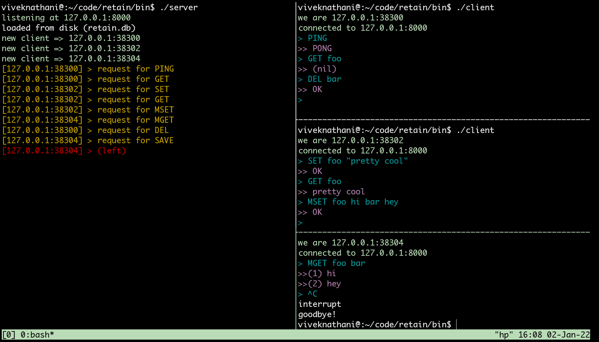

# retain

retain is a key-value store. It is inspired by [Redis](https://redis.io/) and hence uses the client-server interaction is based on [RESP](https://redis.io/topics/protocol) over TCP. It implements a subset of commands supported by Redis.  

[](https://goreportcard.com/report/github.com/viveknathani/retain) [](https://codeclimate.com/github/viveknathani/retain/maintainability) [](https://github.com/viveknathani/retain/actions/workflows/test.yaml) 
 

## motivation

I wrote this as a learning exercise. Redis or any key-value store in general excites me. The kind of things that you can do while implementing such a store are pretty abundant, if not limitless. You can ponder in different layers of this system with questions based on "how". Eg: how do you hold the data in memory? How do you handle concurrent access? What protocols do you use between the client and the server? If you want to persist data, how do you manage the pages to ensure efficient data reads/writes? If you want to make it distributed, what consensus algorithm do you bring in? You probably get the idea. 
  
With that being said, it should be noted that this is not a production grade system and I maintain it at my free will. Don't use it for anything serious. 
  
## commands

Below is a list of the supported commands. It takes heavy inspiration from [here](https://redis.io/commands/).
- ECHO message
- PING [message]
- GET key
- SET key value
- DEL key
- MGET key [key ...]
- MSET key value [key value ...] 
- SAVE

## architecture

- `cmd/` directory contains the client and server programs that can be built and run.
- `protocol` package implements [RESP](https://redis.io/topics/protocol).
- `store` package provides an API for interacting with the underlying map.

## build

```
$ make build
```

After this, you can find the binaries under `./bin/`. 

## contributing

PRs and discussions are welcome. It would be better if you open an issue before raising a PR. 

## license

[MIT](./LICENSE) 
